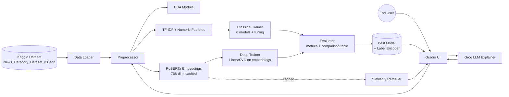

# News Category Classification — System Architecture

## 1. Overview

A multi-class text-classification system that categorises news articles into one of 42 predefined categories using their **headline** and **short description**. The pipeline combines:

- **Classical ML stack** — TF-IDF (uni+bi-gram) + lightweight numeric features → six trained models (Logistic Regression, Linear SVM, KNN, Decision Tree, Random Forest, AdaBoost) with cross-validation and hyper-parameter tuning.
- **Deep representation stack (bonus)** — RoBERTa-base contextual embeddings (768-dim) → Linear SVM classifier.
- **Explanation layer (bonus)** — Groq-hosted Llama 3.3 70B used post-prediction to produce a short human-readable rationale for the predicted category.
- **Demo UI** — A Gradio app launched from a Google Colab notebook with a public share link, exposing prediction, confidence, explanation and similar-article retrieval.

The system is delivered as a runnable Colab notebook plus a modular `src/` package that the notebook imports.

---

## 2. Components

| # | Component | Responsibility | Tech |
|---|---|---|---|
| 1 | **Data Loader** (`src/data_loader.py`) | Authenticate with Kaggle API, download dataset, parse JSON-Lines into a DataFrame | `kaggle`, `pandas` |
| 2 | **Preprocessor** (`src/preprocessing.py`) | Lowercase → strip URLs/HTML/punctuation/digits → tokenize → remove stopwords → lemmatize | `nltk`, `re`, `wordnet` |
| 3 | **EDA Module** (`notebooks/01_eda.ipynb`) | Class distribution, token-length, word frequencies, n-grams, missing/duplicate analysis, word cloud | `matplotlib`, `seaborn`, `wordcloud` |
| 4 | **Feature Builder — Classical** (`src/features.py`) | Build TF-IDF (1-2 ngram, sublinear_tf, capped vocabulary) + numerical features (word/char/punctuation count) | `scikit-learn`, `scipy.sparse` |
| 5 | **Feature Builder — Deep** (`src/embeddings.py`) | Tokenize batches → forward pass through `roberta-base` → mean-pooled 768-d vectors → cache to `.npy` | `transformers`, `torch` |
| 6 | **Trainer — Classical** (`src/train_ml.py`) | Train + tune 6 classifiers with `GridSearchCV` / `RandomizedSearchCV`, persist best estimators | `scikit-learn`, `joblib` |
| 7 | **Trainer — Deep** (`src/train_deep.py`) | Fit `LinearSVC` on cached embeddings | `scikit-learn` |
| 8 | **Evaluator** (`src/evaluate.py`) | Compute Accuracy / Precision / Recall / F1 (macro+weighted) / ROC-AUC (OvR) / per-class confusion matrix; produce model-comparison table | `scikit-learn`, `pandas` |
| 9 | **Similarity Retriever** (`src/retrieval.py`) | Cosine similarity over cached RoBERTa embeddings; return top-k similar articles | `numpy`, `sklearn.metrics.pairwise` |
| 10 | **LLM Explainer** (`src/llm.py`) | Format prompt → call Groq Llama 3.3 70B → return reasoning string; cached by (text-hash, label) | `groq` SDK |
| 11 | **Gradio App** (`app_gradio.py`) | UI: text inputs → orchestrator call → render category + confidence + explanation + similar articles | `gradio` |
| 12 | **Notebook Orchestrator** (`notebooks/00_main.ipynb`) | End-to-end runnable Colab notebook that wires steps 1 → 11 | Jupyter |

---

## 3. System Diagram



---

## 4. Data Flow

### 4.1 Training flow (offline, run once per experiment)

1. `Data Loader` calls Kaggle API and downloads the JSON-Lines file to `data/raw/`.
2. `Preprocessor` builds a normalised text column from `headline + " " + short_description`, applies the cleaning order **lowercase → noise removal → tokenize → stopwords → lemmatize**, and writes `data/processed/cleaned.parquet`.
3. `Feature Builder — Classical` fits `TfidfVectorizer(ngram_range=(1,2), max_features=50_000, sublinear_tf=True)` and stacks the three numeric features as additional columns (sparse-friendly via `hstack`).
4. `Feature Builder — Deep` runs `roberta-base` in inference mode over the cleaned text in batches, mean-pools token embeddings, and caches `(N, 768)` to `data/embeddings/roberta.npy`. Runs once per dataset version; subsequent runs load from cache.
5. `Trainer — Classical` does an 80/20 stratified split (seed = 42), runs CV-tuned training for the six models, persists the best estimator of each to `models/<name>_best.joblib`.
6. `Trainer — Deep` fits `LinearSVC` on the cached embeddings using the same split.
7. `Evaluator` produces metric rows for all seven trained models and writes `reports/model_comparison.csv` + per-model confusion-matrix PNGs.
8. The best model overall is symlinked / copied to `models/best_model.joblib` and is what the Gradio app loads.

### 4.2 Inference flow (Gradio request)

1. User submits **headline** + **description** in the Gradio form.
2. `Preprocessor` applies the **same** cleaning pipeline as training.
3. `Best Model` predicts the category and a confidence score (`predict_proba` for probabilistic models; `decision_function` → softmax / `CalibratedClassifierCV` for SVMs).
4. `Similarity Retriever` embeds the query (or reuses TF-IDF) and returns top-3 most similar training articles by cosine similarity.
5. `LLM Explainer` formats the prompt template (Article / Category / Confidence) and calls Groq; result is `lru_cache`-d by `(sha1(text), label)`.
6. Gradio renders **category, confidence, explanation, similar articles**.

### 4.3 EDA flow (one-shot, for the report)

Runs against the cleaned DataFrame and produces all charts required by the spec section "Visualization & Analysis": dataset shape / dtypes / missing / duplicates / basic stats / class distribution / numeric distributions / boxplots / correlation heatmap / token-length distribution / top-N words / word cloud / n-gram bar charts / outlier and skew checks.

---

## 5. Data Model

This is a flat ML pipeline — there is no relational database. Data lives as files on disk (Colab `/content/...` or mounted Google Drive).

| Entity | Fields | Storage |
|---|---|---|
| Raw article | `category`, `headline`, `short_description`, `authors`, `date`, `link` | `data/raw/News_Category_Dataset_v3.json` |
| Cleaned article | `text`, `category`, `word_count`, `char_count`, `punct_count` | `data/processed/cleaned.parquet` |
| TF-IDF artefact | fitted vectorizer | `models/tfidf_vectorizer.joblib` |
| Numeric feature scaler | fitted scaler (StandardScaler) | `models/numeric_scaler.joblib` |
| RoBERTa embeddings | dense `(N, 768)` `float32` | `data/embeddings/roberta.npy` |
| Index → article map | parallel array of `(headline, category)` for retrieval | `data/embeddings/index.parquet` |
| Trained model | scikit-learn estimator | `models/{name}_best.joblib` |
| Label encoder | category ↔ integer | `models/label_encoder.joblib` |
| Comparison table | per-model metrics | `reports/model_comparison.csv` |
| Confusion matrices | one PNG per model | `reports/confusion/{name}.png` |

---

## 6. API Contracts

There is **no REST API**. The Gradio app exposes a single Python function bound to the UI:

```python
def predict_news(headline: str, description: str) -> dict:
    """
    Returns
    -------
    {
        "category": str,                    # one of 42 labels
        "confidence": float,                # in [0, 1]
        "explanation": str,                 # 2-3 sentences from LLM
        "similar_articles": list[
            {"headline": str, "category": str, "score": float}
        ]                                   # top-3 by cosine similarity
    }
    """
```

Internal module contracts are documented in each `src/*.py` file's docstrings; nothing crosses a network boundary except (a) Kaggle download, (b) Hugging Face model download, (c) Groq inference call.

---

## 7. Authentication & Authorization

Not applicable — academic demo. The Gradio public link is unauthenticated and is intended to be active **only during the live demo / grading session** and torn down afterwards.

External-service credentials are handled as follows:

| Credential | Where it lives | Loaded by |
|---|---|---|
| Kaggle API token | `kaggle.json` at project root (gitignored) | `Data Loader` reads via `KAGGLE_CONFIG_DIR` |
| Groq API key | `GROQ_API_KEY` environment variable (Colab secret or `.env`) | `LLM Explainer` reads via `os.environ` |

**Both keys shared in chat at kickoff must be rotated before any use.** Neither value appears in any committed file.

---

## 8. External Integrations

| Service | Purpose | Auth | Failure mode |
|---|---|---|---|
| Kaggle Datasets API | Download `News_Category_Dataset_v3.json` (~80 MB) | `kaggle.json` | Cache local copy under `data/raw/` so re-runs don't re-download |
| Hugging Face Hub | Pull `roberta-base` weights (~500 MB) on first use | none (public) | Cached by `transformers` in `~/.cache/huggingface` |
| Groq Cloud | `chat.completions` on `llama-3.3-70b-versatile` for explanations | `GROQ_API_KEY` | If Groq fails, Gradio shows category + similar articles and a placeholder explanation; UI never crashes |

---

## 9. Cross-Cutting Concerns

- **Logging:** standard-library `logging` at `INFO` in modules; `tqdm` progress bars for long loops (preprocessing, embedding, CV).
- **Reproducibility:** single `RANDOM_STATE = 42` constant used for `train_test_split`, model seeds, and `np.random.seed`.
- **Caching:**
  - RoBERTa embeddings cached to `.npy` (re-computing 200K is 30+ min on a Colab T4).
  - `lru_cache(maxsize=1024)` on the LLM explainer keyed by `(sha1(text)[:16], label)`.
- **Error handling:** every external call (Kaggle, HF, Groq) wrapped in `try/except` that logs and returns a user-visible Gradio error message rather than aborting the session.
- **Class imbalance:** `class_weight='balanced'` for all classifiers that support it; SMOTE rejected (memory blow-up at 42 classes × 50K-feature TF-IDF).
- **Out of scope for this delivery:** authentication, monitoring, distributed training, model registry, A/B testing, online learning, real-time data ingestion.

---

## 10. Environments

This is an academic project, so "environments" mean development stages, not separate cloud accounts.

| Env | Where | Purpose | Who has access |
|---|---|---|---|
| **Dev** | Each team member's own Colab + their feature branch in GitHub | Implement individual tasks, run unit-level smoke tests | Each individual member |
| **Integration** | Shared Colab notebook running `main` branch + the team's GitHub repo | Verify end-to-end pipeline runs cleanly after merges | All 7 members |
| **Demo** | A final, frozen Colab session for the presentation | Live Gradio public link during grading | Team + grader |

All three run on Colab — no separate cloud infra. Same dependencies (`requirements.txt`), same random seed, same dataset version.

---

## 11. Known Unknowns

| # | Risk | Mitigation |
|---|---|---|
| 1 | RoBERTa embedding extraction on full 200K may exceed Colab GPU session limits | Batch + `torch.no_grad()`; cache to Drive; if blocked, fall back to a stratified 100K subsample (still satisfies bonus) |
| 2 | TF-IDF matrix memory pressure with large vocabulary on 200K samples | Cap `max_features=50_000`, `sublinear_tf=True`, sparse-only operations |
| 3 | Groq free-tier rate limits during demo | Cache explanations; batch nothing through LLM during evaluation; only call on user request |
| 4 | 42 classes with severe imbalance — minority classes <100 samples | `class_weight='balanced'`; report **macro-F1** prominently (not just accuracy); discuss in the written report |
| 5 | Gradio public link expiring after 72h | Re-launch from Colab right before demo; document the launch step in the runbook |
| 6 | 7 students editing notebooks → merge conflicts | Notebooks under `notebooks/` are owned by named people; reusable code lives in `src/` (plain `.py`, easy to merge) |
