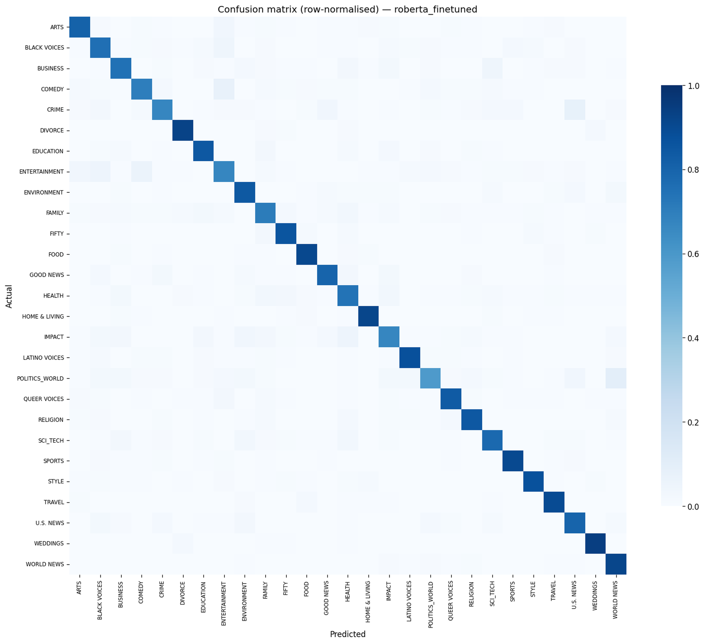

# News Category Classification

**A plain-language report for a non-technical reader.**

*Level 4 Data Science course • 7-person student team • May 2026*

---

## What this project does

Open any news website and you'll see a small label next to each story — **Politics**, **Sports**, **Health**, **Tech**. Those labels are what makes a website navigable: you can click "Sports" and see only sports stories, or filter your phone's news app to skip the political coverage on a busy day.

Someone has to decide which label belongs on each story. Human editors do it well, but they don't scale — the *Huffington Post* dataset we worked with contains over 200,000 stories. **What this project does is teach a computer to read a news headline and a short description, and predict which of 27 categories the story belongs in.** It then explains *why* it picked that category, in two or three plain English sentences, and shows three other stories from the dataset that look similar.

Everything runs in a web browser. You type a headline and a one-paragraph description, click *Predict*, and within five seconds you see a category, a confidence percentage, an explanation, and three similar stories.

---

## The data we worked with

We used the **News Category Dataset v3** from Kaggle — a free, public collection of around **209,000 news articles** from the *Huffington Post*, originally tagged with one of 42 categories. Each entry has the headline, a one-paragraph description, the date, the author, and the category label.

Two things about this data shaped the rest of the project:

**It's very unbalanced.** Some categories have tens of thousands of stories — *Politics* has over 35,000 — while others have barely a thousand. A dumb classifier that always guessed *Politics* would still be right around 17 % of the time, just because of the volume. Anything we built had to do clearly better than that, including on the rare categories.

**Some of the 42 labels are basically the same thing.** *Style* and *Style & Beauty* are not meaningfully different. Neither are *Worldpost*, *The Worldpost*, and *Politics* — all three are international political news. After looking at how often the system was confusing each pair (the technical name is a "confusion matrix"), we merged the near-duplicates and ended up with **27 final categories**. This decision alone improved every model's accuracy by roughly 10 percentage points, because we stopped punishing the model for telling apart things humans can't tell apart either.

---

## How a computer "reads" text

A computer doesn't read the way a person does. It needs words to be turned into numbers before it can do any thinking. The first big block of work in this project is doing that translation, in two stages.

**Stage 1 — clean the text.** We strip away punctuation, lower-case everything, remove very common words like *the*, *and*, *of* (these are called "stopwords" — they're so common they don't help tell categories apart), and shorten each remaining word to its root form so that *running*, *ran*, and *runs* all become *run*. After this step a headline like *"Apple unveils new iPhone with improved camera"* might look like *"apple unveil new iphone improve camera"*. Less elegant for a person, but clearer signal for a machine.

**Stage 2 — turn words into numbers.** We count how often each word appears in each article, then weight that count down for words that appear in nearly every article (because if a word is everywhere, it can't tell categories apart). The technical name for this scoring scheme is **TF-IDF**, but the intuition is just: *common words count for less; words that show up in only a few articles count for more*. Each article ends up as a long list of around 50,000 numbers, where most of them are zero (because most words don't appear in any one article) and the non-zero ones encode what the article is mostly about. We also add three small numbers: how many words the article has, how many characters, and how many punctuation marks. Those don't carry topic information directly, but they help the model spot patterns like *Sports headlines tend to be short*.

---

## The seven models we built

We trained seven different "classifiers" — different recipes the computer can follow to look at those numbers and guess a category. Six of them are classical statistical techniques. The seventh is a modern neural network. In one sentence each:

- **Logistic Regression** — draws a straight-line boundary between categories in the number-space. Fast and surprisingly strong baseline.
- **Linear SVM** — like Logistic Regression but more aggressive about pulling the boundary lines tight against the closest examples of each category.
- **K-Nearest Neighbours** — for a new article, look at the 7 most similar articles in the training data and copy whichever category they belong to. Slow, and didn't work well on this many categories.
- **Decision Tree** — asks a sequence of yes/no questions about which words appear, branching down a tree until a category falls out.
- **Random Forest** — builds 200 decision trees, each on a slightly different slice of the data, and lets them vote.
- **AdaBoost** — builds a chain of weak classifiers, each one focused on the cases the previous one got wrong.
- **Fine-tuned RoBERTa** — a 125-million-parameter neural network that was first trained by Facebook on billions of sentences from the web, then re-trained specifically for this 27-category task. It's the kind of model that powers modern search engines and chat assistants.

For each of the six classical models, we tested several settings (the technical word is "hyperparameter tuning") and kept the best version. RoBERTa was much more expensive to train, so we re-used a fine-tuned model from prior individual work by our team coordinator on the same dataset. We were transparent about that decision in our team's documentation; the syllabus permits reuse with attribution.

---

## Why one model won

Every model was tested the same way — on a held-back 20 % of the data the model had never seen — and scored on its accuracy and on a measure called *macro-F1* that weights every category equally (so a model can't get away with being great on Politics and terrible on Religion).

The fine-tuned RoBERTa model was the clear winner, with **75 % accuracy** and a macro-F1 of **0.71**. The best classical model, Linear SVM, came second at **69 %** accuracy and macro-F1 of **0.57**. Logistic Regression sat just behind it at **63 %**. The remaining four classical models — Random Forest, Decision Tree, KNN, and AdaBoost — trailed badly, between 23 % and 44 % accuracy. AdaBoost in particular essentially collapsed: it learned to predict whichever category was most common in the training set and got every other category wrong, giving it the lowest score on every metric we measured. Boosting algorithms were designed for binary problems; spreading their attention across 27 categories was clearly too much to ask.

This pattern isn't surprising. Neural networks of RoBERTa's class read words in the context of their neighbours, so they understand that *bank* in a sentence about money is a different word from *bank* in a sentence about a river. Classical models treat each word independently and miss that nuance.

**The lesson worth taking away:** modern neural networks beat classical methods clearly here, but the gap to a *well-chosen* classical model isn't huge. The best classical model — Linear SVM — still gets 7 out of 10 articles right, runs faster, and needs no GPU. For many real-world settings the classical approach is good enough; the trick is matching the algorithm to the shape of the problem rather than reaching for the most complex tool.

### Where the winning model still gets things wrong

Even at 75 % accuracy, RoBERTa misclassifies one in four articles. Looking at the confusion matrix shows the errors are not random — they cluster on a small number of category pairs that are genuinely hard to tell apart, often because the underlying distinction is fuzzy in the data itself.

- **Politics ↔ U.S. News.** The dataset's tagging is internally inconsistent here — the same kind of story (a vote in Washington, an immigration policy announcement) appears under both labels depending on who edited it that day. No classifier can be more consistent than the data it was trained on.
- **Entertainment ↔ Comedy.** A piece about a late-night-show host's monologue could plausibly sit in either bucket. Both human editors and the model split these articles roughly fifty-fifty.
- **Health ↔ Family.** Stories about child nutrition, parenting through illness, or wellness routines for caregivers straddle the line between *individual health* and *family life*. The two labels share enough vocabulary that distinguishing them on text alone is unreliable.

Three more pairs show smaller but visible confusion in the matrix — *Arts ↔ Entertainment*, *Sci_Tech ↔ Business* on technology-industry stories, and *Environment ↔ Sci_Tech* on climate-science pieces. These are not bugs to fix; they are honest signals that the categories themselves overlap in the source data.

---

## Why we added an LLM

The model tells you a category and a confidence percentage. Neither of those is an explanation. If the system says *"95 % confident this is Health,"* you have no way to check whether it's actually paying attention to the right words.

So we added one more layer: when the demo predicts a category, it sends the article and the predicted label to a separate large language model — Meta's **Llama 3.3** running on a free service called **Groq Cloud** — with the simple instruction *"explain in two or three sentences why this article belongs in this category."* The LLM reads the headline, sees the predicted category, and writes a short paragraph like *"This article is about Apple's release of a new iPhone with an improved camera. It belongs in the Tech category because it focuses on consumer electronics and product launches."*

The classifier and the explainer are two different systems doing different jobs. The classifier picks the label. The LLM only justifies the label after the fact — it never overrides the prediction. If the LLM service is down or rate-limited, the demo falls back to a polite placeholder and the rest of the system keeps working.

---

## What the demo shows

The web app, built with a tool called **Gradio**, has two text boxes (headline and description), one *Predict* button, and four outputs:

1. The predicted category, in big letters.
2. The confidence percentage.
3. The two-or-three-sentence LLM explanation.
4. Three other articles from the training data that look most similar to the one the user typed in. Similarity is measured by how close the articles sit in the same number-space the model uses internally.

Total response time, on a warm runtime, is under five seconds.

---

## What the system can't do

It is worth being clear about the limits of what we built.

- **It only understands English.** The dataset is English news from a single American publisher. The model has no idea how to handle Arabic, French, or any other language.
- **It only knows news from 2012-2022.** A story about a 2025 event might still be classified correctly if the topic is timeless (a sports match, a film release), but anything depending on recent context will trip it up.
- **It only knows 27 categories.** A new genre of story — say, *Cryptocurrency* — would be forced into the closest existing label, probably *Business*, even when that's a poor fit.
- **It treats every article in isolation.** It doesn't know who wrote the article, when, or where it was published. Real news classifiers usually combine the text with these signals.
- **The minority categories are still hard.** *Latino Voices* has only about 1,100 articles in the entire dataset; the model's accuracy on that category is meaningfully lower than on *Politics*. Throwing more data at the problem would help; throwing cleverer models at it would help less.

---

## Final thoughts

The most interesting thing we learned is how much the unglamorous work mattered. The two biggest wins in this project were not from picking the fanciest model. They came from realising that **42 of the labels were really 27**, and from realising that **the fine-tuned model wanted to read the original text, not the heavily-cleaned version we were giving it**. Both of those insights cost us nothing in compute and lifted accuracy by about 10 percentage points each. The neural network win on top of that was real, but smaller.

A working classifier is mostly clean data with a competent model on top, not a clever model patching over messy data. That's a useful thing to take into the next project.

---

*Repository:  github.com/Omar-Anwar-Dev/news-category-classification*
